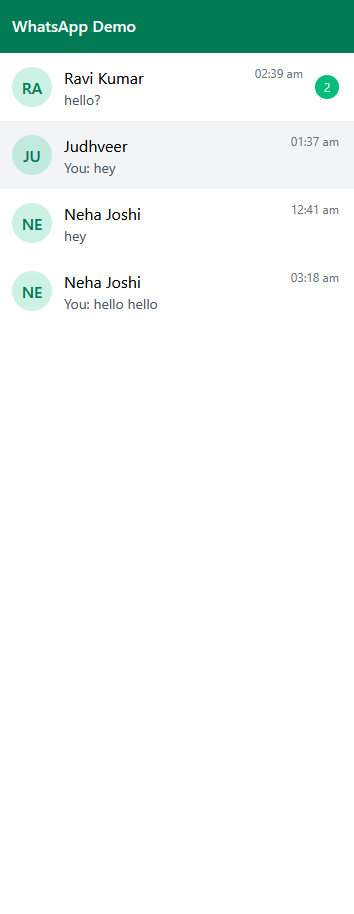
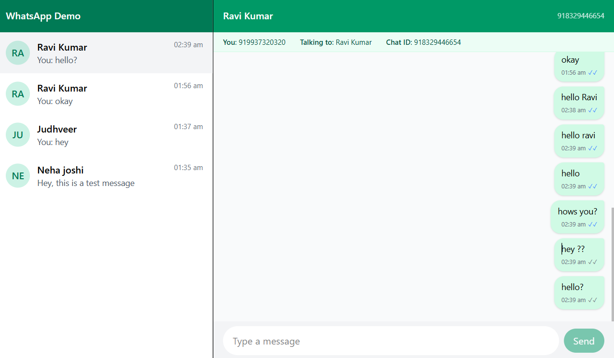

# rapidQuest-Whatsapp-Clone-Assignment

---

# WhatsApp Web Clone – Full Stack Implementation

A real-time **WhatsApp Web–like chat interface** built with **Node.js, Express, MongoDB, and React**, designed for processing and displaying simulated WhatsApp Business API webhook data.  
This project was built as part of the **Full Stack Developer Evaluation Task**.

---

##  Live Demo
**[View Deployed App](https://rapid-quest-whatsapp-clone.vercel.app/)**  
**[GitHub Repository](https://github.com/judhveer/rapidQuest-Whatsapp-Clone-Assignment)**

---

## Features

- **Webhook Payload Processor** – Reads sample payloads and stores messages in MongoDB.
- **WhatsApp Web–Like UI** – Responsive design, chat list, conversation view, status indicators.
- **Send Message (Demo)** – Send messages that appear instantly and persist in DB.
- **Real-Time Updates** – Socket.IO for live message and status updates (sent ✅, delivered ✅✅, read ✅✅ in blue).
- **Responsive & Mobile Friendly** – Works seamlessly on desktop and mobile.
- **Cloud Deployment** – Hosted on a public URL for instant access.

---

## 🛠️ Tech Stack

**Frontend**
- React + Vite
- TailwindCSS for styling
- Socket.IO Client

**Backend**
- Node.js + Express
- MongoDB Atlas
- Socket.IO Server
- Mongoose for DB modeling
- Helmet, Compression, Morgan, CORS for security & performance

**Hosting**
- Backend: Render
- Frontend: Vercel / Netlify (Choose the one you used)
- Database: MongoDB Atlas

---

## 📂 Project Structure


whatsapp-web-clone/
├── client/
│   ├── src/
│   │   ├── api/
│   │   ├── components/   # UI Components
│   │   ├── sockets/
│   │   ├── utils/        # Helper functions
│   │   ├── App.css
│   │   ├── App.jsx
│   │   ├── index.css
│   │   └── main.jsx
│   ├── vite.config.js
│   └── .env
├── server/
│   ├── payloads/           
│   ├── src/  
│   │   ├── controllers/    # Request controllers
│   │   ├── models/         # Mongoose models
│   │   ├── routes/         # API route handlers
│   │   ├── scripts/      
│   │   ├── services/       # Socket & DB services
│   │   ├── utils/
│   │   ├── db.js           # DB connection
│   │   └── index.js        # App entry point
│   └── .env
├── .gitignore
└── README.md


---

## 📜 API Endpoints

| Method | Endpoint                            | Description                                                           |
| ------ | ----------------------------------- | --------------------------------------------------------------------- |
| GET    | `/api/chats`                        | Fetch all chat threads (list of conversations with last message info) |
| GET    | `/api/chats/:wa_id/messages`        | Fetch all messages for a given contact (`wa_id`)                      |
| POST   | `/api/messages`                     | Create a new outgoing message and save it to the database             |
| PUT    | `/api/messages/:meta_msg_id/status` | Update a message’s status (`sent`, `delivered`, or `read`)            |


---

## ⚙️ Setup & Installation

1️⃣ **Clone Repository**
```bash
git clone https://github.com/judhveer/rapidQuest-Whatsapp-Clone-Assignment.git
cd rapidQuest-Whatsapp-Clone-Assignment
````

2️⃣ **Install Dependencies**

```bash
# Backend
cd server
npm install

# Frontend
cd ../client
npm install
```

3️⃣ **Configure Environment Variables**
Create `.env` in `backend/`:

```env
PORT=8080
MONGODB_URI=your-mongodb-uri
CLIENT_ORIGIN=http://localhost:5173
```

Create `.env` in `backend/`:
```env
VITE_API_BASE_URL=http://localhost:8080
```

4️⃣ **Run Locally**

```bash
# Start backend
cd server
npm run dev

# Start frontend
cd ../client
npm run dev
```

---

## 🔗 WebSocket Events

**Client → Server**

* `identify` → Register user session
* `chat:open` → Mark chat messages as read

**Server → Client**

* `message:new` → New message received
* `message:status` → Status update for a message
* `chat:read` → All messages from a chat marked as read

---

## 📸 Screenshots

| Chat List                                       | Conversation View                                       |
| ----------------------------------------------- | ------------------------------------------------------- |
|  |  |

---

## 📦 Deployment

* **Backend:** Render  (https://rapidquest-whatsapp-clone.onrender.com)
* **Frontend:** Vercel (https://rapid-quest-whatsapp-clone.vercel.app/)
* **Database:** MongoDB Atlas
* **Domain:** [https://rapid-quest-whatsapp-clone.vercel.app/](https://rapid-quest-whatsapp-clone.vercel.app/)

---

## 📬 Contact

👤 **Judhveer**
📧 [judhveer@proton.me](mailto:judhveer@proton.me)
💼 [LinkedIn](https://linkedin.com/in/judhveer) • [GitHub](https://github.com/judhveer)


